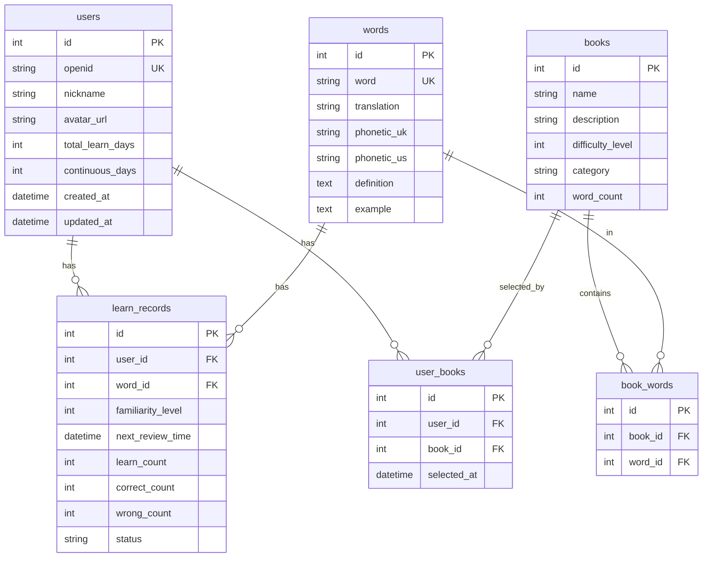

# 单词学习小程序 - 完整项目文档

## 📖 项目简介

单词学习小程序是一款基于微信小程序的智能英语单词学习工具,采用科学的间隔重复算法(SRS),帮助用户高效记忆单词。

### 核心特性

- 🎯 **智能学习**: 基于艾宾浩斯遗忘曲线的间隔重复算法
- 📚 **多词书支持**: 小学、初中、高中、四六级、考研、雅思、托福
- 📊 **学习统计**: 实时统计学习进度、打卡记录、学习日历
- 👤 **微信登录**: 一键登录,数据云端同步
- 📅 **学习日历**: 可视化展示每日学习情况
- 🎨 **精美UI**: 现代化设计,流畅的用户体验

---

## 🏗️ 技术架构

### 前端技术栈

| 技术 | 版本 | 说明 |
|------|------|------|
| 微信小程序 | 最新 | 小程序框架 |
| JavaScript | ES6+ | 编程语言 |
| WXML | - | 页面结构 |
| WXSS | - | 样式语言 |

### 后端技术栈

| 技术 | 版本 | 说明 |
|------|------|------|
| Node.js | 16+ | 运行环境 |
| Koa | 2.x | Web框架 |
| Sequelize | 6.x | ORM框架 |
| MySQL | 5.7+ | 数据库 |
| JWT | - | 身份认证 |

### 项目结构

```
word-learning-app/
├── miniprogram/              # 小程序前端
│   ├── pages/               # 页面目录
│   │   ├── index/          # 首页
│   │   ├── learn/          # 学习页
│   │   ├── test/           # 测试页
│   │   ├── wordbook/       # 生词本
│   │   ├── stats/          # 统计页
│   │   ├── profile/        # 我的页面
│   │   └── login/          # 登录页
│   ├── utils/              # 工具函数
│   │   ├── request.js      # 网络请求
│   │   ├── auth.js         # 认证工具
│   │   └── storage.js      # 本地存储
│   ├── app.js              # 小程序入口
│   ├── app.json            # 全局配置
│   └── app.wxss            # 全局样式
│
├── server/                  # 后端服务
│   ├── src/
│   │   ├── controllers/    # 控制器
│   │   ├── services/       # 业务逻辑
│   │   ├── models/         # 数据模型
│   │   ├── routes/         # 路由
│   │   ├── middlewares/    # 中间件
│   │   ├── utils/          # 工具函数
│   │   └── app.js          # 应用入口
│   ├── database/           # 数据库脚本
│   ├── .env.example        # 环境变量示例
│   └── package.json        # 依赖配置
│
└── docs/                    # 文档目录
```

---

## 💾 数据库设计

### ER图



### 核心表说明

#### users - 用户表
存储用户基本信息和学习统计数据。

| 字段 | 类型 | 说明 |
|------|------|------|
| id | INT | 主键 |
| openid | VARCHAR(100) | 微信OpenID,唯一标识 |
| nickname | VARCHAR(50) | 用户昵称 |
| avatar_url | VARCHAR(500) | 头像URL |
| total_learn_days | INT | 累计学习天数 |
| continuous_days | INT | 连续学习天数 |

#### books - 词书表
存储不同类型的词书信息。

| 字段 | 类型 | 说明 |
|------|------|------|
| id | INT | 主键 |
| name | VARCHAR(100) | 词书名称 |
| description | TEXT | 词书描述 |
| difficulty_level | INT | 难度等级(1-5) |
| category | VARCHAR(50) | 分类(小学/初中/考试等) |
| word_count | INT | 单词总数 |

#### words - 单词表
存储单词的详细信息。

| 字段 | 类型 | 说明 |
|------|------|------|
| id | INT | 主键 |
| word | VARCHAR(100) | 单词 |
| translation | VARCHAR(500) | 中文翻译 |
| phonetic_uk | VARCHAR(100) | 英式音标 |
| phonetic_us | VARCHAR(100) | 美式音标 |
| definition | TEXT | 英文释义 |
| example | TEXT | 例句 |

#### learn_records - 学习记录表
存储用户的学习记录和复习计划。

| 字段 | 类型 | 说明 |
|------|------|------|
| id | INT | 主键 |
| user_id | INT | 用户ID |
| word_id | INT | 单词ID |
| familiarity_level | INT | 熟悉度(0-5) |
| next_review_time | DATETIME | 下次复习时间 |
| learn_count | INT | 学习次数 |
| correct_count | INT | 正确次数 |
| wrong_count | INT | 错误次数 |
| status | ENUM | 状态(learning/mastered) |

---

## 🔌 API文档

### 认证相关

#### 微信登录
```http
POST /api/v1/auth/wx-login
Content-Type: application/json

{
  "code": "微信登录code",
  "userInfo": {
    "nickName": "用户昵称",
    "avatarUrl": "头像URL"
  }
}

Response:
{
  "code": 200,
  "message": "success",
  "data": {
    "token": "JWT_TOKEN",
    "user": {
      "id": 1,
      "nickname": "用户昵称",
      "avatar_url": "头像URL"
    }
  }
}
```

#### 获取用户信息
```http
GET /api/v1/auth/profile
Authorization: Bearer JWT_TOKEN

Response:
{
  "code": 200,
  "data": {
    "id": 1,
    "nickname": "用户昵称",
    "avatar_url": "头像URL",
    "total_learn_days": 10,
    "continuous_days": 5
  }
}
```

### 词书相关

#### 获取词书列表
```http
GET /api/v1/books

Response:
{
  "code": 200,
  "data": {
    "books": [
      {
        "id": 1,
        "name": "小学英语",
        "description": "小学阶段核心词汇",
        "difficulty_level": 1,
        "category": "小学",
        "word_count": 565
      }
    ]
  }
}
```

### 学习相关

#### 获取每日学习任务
```http
GET /api/v1/learn/daily-task?bookId=1&limit=10
Authorization: Bearer JWT_TOKEN

Response:
{
  "code": 200,
  "data": {
    "review": [],      // 需要复习的单词
    "new": [],         // 新单词
    "total": 10
  }
}
```

#### 提交学习记录
```http
POST /api/v1/learn/record
Authorization: Bearer JWT_TOKEN
Content-Type: application/json

{
  "wordId": 1,
  "isKnown": true
}

Response:
{
  "code": 200,
  "message": "学习记录提交成功",
  "data": {
    "id": 1,
    "familiarity_level": 1,
    "next_review_time": "2025-12-07T10:00:00.000Z"
  }
}
```

### 统计相关

#### 获取学习统计
```http
GET /api/v1/stats/overview
Authorization: Bearer JWT_TOKEN

Response:
{
  "code": 200,
  "data": {
    "stats": {
      "total_learn_days": 10,
      "continuous_days": 5,
      "total_words": 100,
      "mastered_words": 30,
      "today_words": 10
    }
  }
}
```

#### 获取词书统计
```http
GET /api/v1/stats/book/1
Authorization: Bearer JWT_TOKEN

Response:
{
  "code": 200,
  "data": {
    "stats": {
      "total_words": 565,
      "learned_words": 100,
      "unlearned_words": 465,
      "mastered_words": 30,
      "learning_words": 70,
      "progress": 18
    }
  }
}
```

#### 获取学习日历
```http
GET /api/v1/stats/calendar?days=30
Authorization: Bearer JWT_TOKEN

Response:
{
  "code": 200,
  "data": {
    "calendar": [
      {
        "date": "2025-12-06",
        "count": 10,
        "hasLearned": true
      }
    ]
  }
}
```

---

## 🎯 核心功能实现

### 1. 间隔重复算法 (SRS)

基于艾宾浩斯遗忘曲线,计算下次复习时间:

```javascript
// utils/srs.js
function calculateNextReviewTime(record, isKnown) {
    const { familiarity_level } = record;
    let newLevel = isKnown ? familiarity_level + 1 : Math.max(0, familiarity_level - 1);
    
    // 复习间隔(小时)
    const intervals = [0, 4, 8, 24, 48, 168, 720]; // 0, 4h, 8h, 1d, 2d, 7d, 30d
    const hours = intervals[newLevel] || 720;
    
    const nextReviewTime = new Date();
    nextReviewTime.setHours(nextReviewTime.getHours() + hours);
    
    return {
        familiarity_level: newLevel,
        next_review_time: nextReviewTime
    };
}
```

### 2. 打卡天数自动更新

每次学习后自动更新用户的打卡记录:

```javascript
// services/learn.service.js
async updateUserLearnDays(userId) {
    // 获取所有学习日期
    const allRecords = await LearnRecord.findAll({
        where: { user_id: userId },
        attributes: ['last_review_time']
    });
    
    // 统计不同日期
    const learnDates = new Set();
    allRecords.forEach(record => {
        const dateStr = formatDate(record.last_review_time);
        learnDates.add(dateStr);
    });
    
    // 计算连续天数
    let continuousDays = 0;
    const today = new Date();
    for (let i = 0; i < 365; i++) {
        const checkDate = new Date(today);
        checkDate.setDate(checkDate.getDate() - i);
        if (learnDates.has(formatDate(checkDate))) {
            continuousDays++;
        } else {
            break;
        }
    }
    
    // 更新用户记录
    await user.update({
        total_learn_days: learnDates.size,
        continuous_days: continuousDays
    });
}
```

### 3. 数据隔离

所有API都基于用户ID进行数据隔离:

```javascript
// controllers/stats.controller.js
async getOverview(ctx) {
    const userId = ctx.state.user.id;  // 从JWT获取用户ID
    const overview = await statsService.getOverview(userId);
    ctx.body = success(overview);
}
```

---

## 🎨 UI设计规范

### 颜色方案

| 用途 | 颜色 | Hex |
|------|------|-----|
| 主色 | 紫色渐变 | #667eea → #764ba2 |
| 成功 | 绿色 | #10b981 |
| 警告 | 橙色 | #f59e0b |
| 错误 | 红色 | #ef4444 |
| 文字主色 | 深灰 | #1f2937 |
| 文字次色 | 中灰 | #6b7280 |
| 背景色 | 浅灰 | #f5f5f5 |

### 组件规范

#### 卡片 (Card)
```wxss
.card {
  background: white;
  border-radius: 16rpx;
  padding: 40rpx;
  margin-bottom: 30rpx;
  box-shadow: 0 4rpx 12rpx rgba(0, 0, 0, 0.05);
}
```

#### 按钮 (Button)
```wxss
.btn-primary {
  background: linear-gradient(135deg, #667eea 0%, #764ba2 100%);
  color: white;
  border-radius: 50rpx;
  height: 100rpx;
  font-size: 32rpx;
  font-weight: 600;
}
```

---

## 🔧 开发指南

### 环境搭建

1. **安装Node.js** (v16+)
2. **安装MySQL** (v5.7+)
3. **安装微信开发者工具**

### 本地开发

```bash
# 1. 克隆项目
git clone https://github.com/YOUR_USERNAME/word-learning-app.git
cd word-learning-app

# 2. 安装后端依赖
cd server
npm install

# 3. 配置环境变量
cp .env.example .env
# 编辑.env文件,填写数据库和微信配置

# 4. 初始化数据库
mysql -u root -p < database/schema.sql
mysql -u root -p < database/seed.sql

# 5. 启动后端服务
npm run dev

# 6. 打开微信开发者工具
# 导入miniprogram目录
# 填写AppID并运行
```

### 代码规范

#### JavaScript
- 使用ES6+语法
- 使用async/await处理异步
- 函数命名使用驼峰命名法
- 常量使用大写下划线

#### 数据库
- 表名使用复数形式
- 字段名使用下划线命名
- 必须有created_at和updated_at字段

#### 提交规范
```
feat: 新功能
fix: 修复bug
docs: 文档更新
style: 代码格式调整
refactor: 重构
test: 测试相关
chore: 构建/工具相关
```

---

## 📈 性能优化

### 前端优化
- ✅ 图片懒加载
- ✅ 分页加载数据
- ✅ 本地缓存token和用户信息
- ✅ 防抖节流处理

### 后端优化
- ✅ 数据库索引优化
- ✅ SQL查询优化
- ✅ JWT token缓存
- ✅ API响应压缩

### 数据库优化
```sql
-- 添加索引
CREATE INDEX idx_user_id ON learn_records(user_id);
CREATE INDEX idx_word_id ON learn_records(word_id);
CREATE INDEX idx_next_review ON learn_records(next_review_time);
CREATE INDEX idx_book_id ON book_words(book_id);
```

---

## 🔒 安全措施

### 1. 身份认证
- JWT token验证
- token过期时间7天
- 密钥存储在环境变量

### 2. 数据验证
- 输入参数验证
- SQL注入防护(使用ORM)
- XSS防护

### 3. 数据隔离
- 所有查询基于user_id
- 用户数据完全独立
- 无法访问其他用户数据

---

## 📊 监控与日志

### 日志记录
```javascript
// 使用console.log记录关键操作
console.log('用户登录:', userId);
console.log('学习记录提交:', { userId, wordId, isKnown });
```

### PM2监控
```bash
# 查看进程状态
pm2 status

# 查看日志
pm2 logs word-learning-api

# 查看监控面板
pm2 monit
```

---

## 🚀 未来规划

### 短期计划
- [ ] 添加单词发音功能
- [ ] 实现单词收藏功能
- [ ] 添加学习提醒推送
- [ ] 优化学习算法

### 长期计划
- [ ] 支持自定义词书
- [ ] 添加社交功能(排行榜)
- [ ] 开发Web版本
- [ ] 支持多语言学习

---

## 📄 许可证

MIT License

---

## 👥 贡献指南

欢迎提交Issue和Pull Request!

1. Fork项目
2. 创建特性分支 (`git checkout -b feature/AmazingFeature`)
3. 提交更改 (`git commit -m 'Add some AmazingFeature'`)
4. 推送到分支 (`git push origin feature/AmazingFeature`)
5. 开启Pull Request

---

**项目地址**: https://github.com/YOUR_USERNAME/word-learning-app

**技术支持**: your-email@example.com
